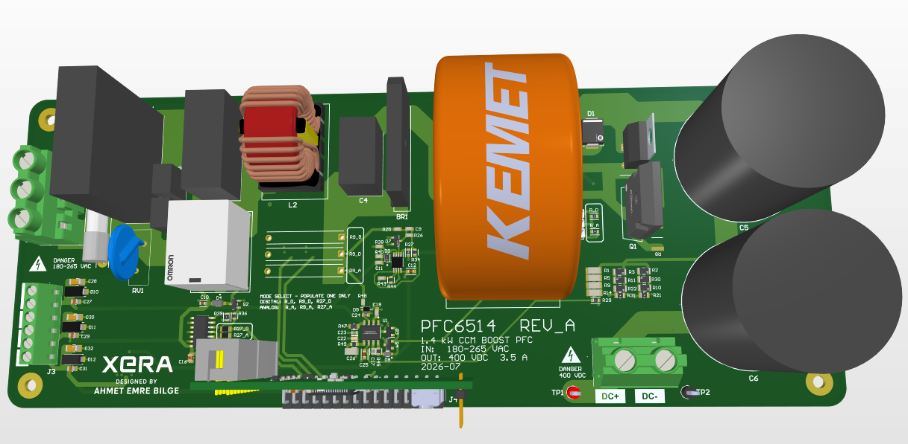
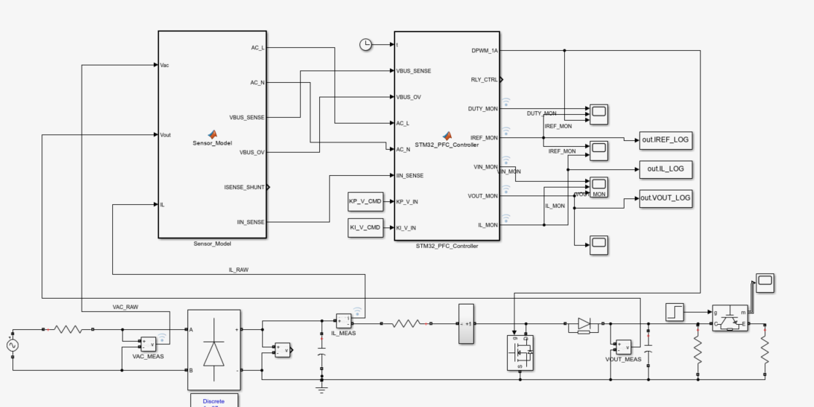
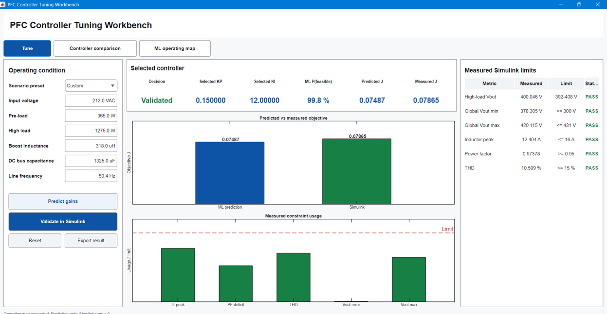
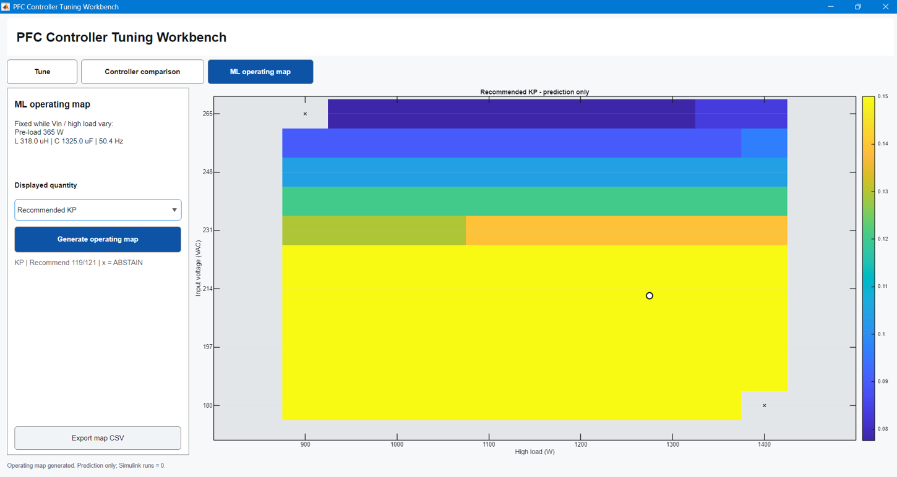
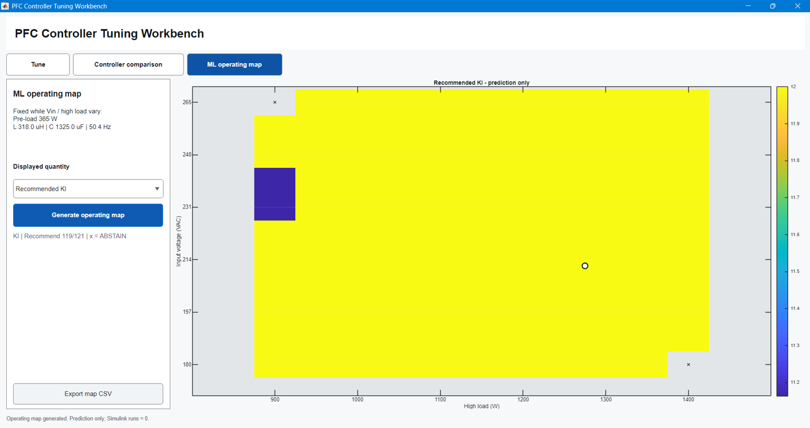

# 1.4 kW Boost PFC — ML-Assisted PI Controller Tuning

This repository contains the MATLAB/Simulink workbench I developed for a **1.4 kW single-phase boost PFC converter**. The power stage was designed in Altium, the controller is intended for an **STM32G474**, and the machine-learning layer is used to select the outer voltage-loop PI gains under changing operating conditions.

The ML model does **not** generate PWM directly. The conventional digital PFC controller remains responsible for the converter; ML is used as a higher-level gain-selection tool.

## System

| Parameter | Value |
|---|---:|
| AC input | 180–265 VAC |
| DC-link target | 400 VDC |
| Rated power | 1.4 kW |
| Switching frequency | 75 kHz |
| Nominal boost inductance | 311 µH |
| Nominal DC-link capacitance | 1360 µF |
| Digital controller target | STM32G474 |
| Development environment | MATLAB R2025a / Simulink |

## Hardware design

The boost PFC power stage was designed in Altium and the PCB has been manufactured. Hardware validation is the next step after the simulation and controller-tuning work shown here.



## Simulink model

I built a switching-level Simulink model of the same system to test the controller before hardware measurements. The model includes the AC source, bridge rectifier, boost stage, DC-link, load, sensing model and the digital controller structure.



The simulations vary input voltage, load, inductance, capacitance and line frequency. Different PI gain pairs are evaluated under those conditions.

## What the ML model learns

The training target is not a direct **operating condition → Kp/Ki** lookup.

Instead, the model learns the relationship:

> **operating condition + candidate Kp/Ki → expected controller performance**

Simulation results include voltage regulation, load-step response, ripple, inductor-current peak, power factor and THD. These measurements are combined with feasibility and safety checks before a gain pair is recommended.

The current pipeline uses:

- **Gaussian Process Regression (GPR)** for performance prediction
- **Bagged decision trees** for feasibility classification
- **GPR** for regulation-margin estimation

GPR was selected because the available dataset is relatively small and its prediction uncertainty is useful when deciding whether a recommendation should be trusted. If the model is outside its reliable region or the feasibility checks fail, it can abstain instead of forcing a recommendation.

## Controller Tuning Workbench

The MATLAB GUI combines gain prediction and Simulink validation in one place.

### Tune and validate

The operating condition is entered on the **Tune** page. The trained models select Kp/Ki and predict the objective value. The same gains can then be run in the switching Simulink model, allowing the ML prediction to be compared with measured simulation results.



### Operating map

The operating map shows how the recommended gains change with input voltage and load. These maps are **prediction-only**; a new Simulink run is not executed for every displayed cell.

<p align="center">
  
  
</p>

Cells marked with `x` are points where the recommendation logic abstains.

## Project flow

1. Design the boost PFC power stage and digital controller.
2. Build the switching model in Simulink.
3. Generate measured simulation data at different operating conditions and PI gains.
4. Extract regulation, transient and power-quality metrics.
5. Train the performance, feasibility and margin models in MATLAB.
6. Search candidate Kp/Ki pairs using the trained models.
7. Validate the selected gains in the switching Simulink model.
8. Test the same control approach on the manufactured PCB.

## Run

The project was developed with **MATLAB R2025a**. Simulink and the MATLAB machine-learning functions used by the project are required.

First verify the package:

```matlab
verify_pfc_stage12_package
```

Then launch the workbench:

```matlab
launch_pfc_ml_dashboard
```

For the prediction-only operating map:

```matlab
build_pfc_stage12_operating_map
```

## Main files

| File | Purpose |
|---|---|
| `Boost_PFC_BayesOpt_v1_WORKING_BASELINE.slx` | Protected switching Simulink model |
| `pfc_ml_config.m` | Project configuration and limits |
| `run_single_pfc_case.m` | Runs one switching simulation and extracts metrics |
| `predict_pfc_stage12_gains.m` | ML-based PI gain recommendation |
| `run_pfc_stage12_final_hybrid_tuner.m` | Prediction, validation and guarded update workflow |
| `compare_pfc_stage12_controllers.m` | Controller comparison |
| `build_pfc_stage12_operating_map.m` | Prediction-only operating map |
| `launch_pfc_ml_dashboard.m` | MATLAB GUI |
| `verify_pfc_stage12_package.m` | Package and baseline-integrity verification |

The `pfc_ml_outputs_*` folders contain the data/model artifacts required by the current workbench. They are intentionally kept in their original folder names because the MATLAB code references those paths.

## Current status

The results in this repository are from **switching Simulink simulations**, not hardware measurements. The PCB has been manufactured; hardware testing and simulation-to-hardware comparison are the next stage.

---

**Ahmet Emre Bilge**  
Electrical-Electronics Engineering, Abdullah Gül University
